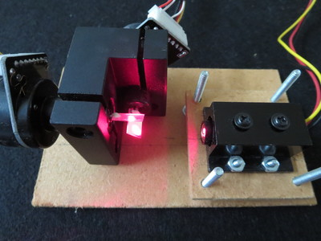
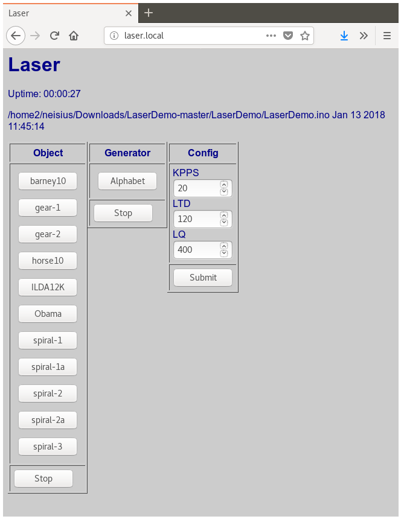
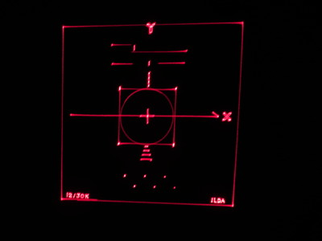
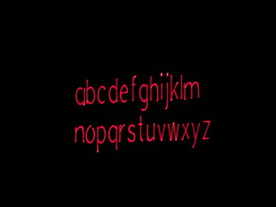
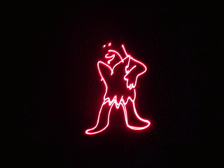

# LaserDemo
Generate display patterns for laser galvanometer, using ESP8266

Based on "Arduino Laser Show With Real Galvos" by DeltaFlo:

http://www.instructables.com/id/Arduino-Laser-Show-With-Real-Galvos/


## Hardware

* Adafruit HUZZAH ESP8266 (https://www.adafruit.com/product/2821)
* Laser Galvonometer (e.g.: https://www.ebay.com/itm/20Kpps-max-30kpps-laser-scanning-galvo-scanner-ILDA-Closed-Loop-for-laser-show-/302624823271)
* TTL Laser Diode (https://www.adafruit.com/product/1056)
* Fixed Laser Mounting Stand (https://www.adafruit.com/product/1094)
* Dual Channel 12-bit DAC (MCP4822 or MCP4922.  see: http://www.instructables.com/id/Arduino-Laser-Show-With-Real-Galvos/ for details)
* Bipolar Amplifier (see: http://www.instructables.com/id/Arduino-Laser-Show-With-Real-Galvos/ for details)

### Memory usage:
```
Sketch uses 483399 bytes (46%) of program storage space. Maximum is 1044464 bytes.
Global variables use 41296 bytes (50%) of dynamic memory, leaving 40624 bytes for local variables. Maximum is 81920 bytes.
```
### Laser Mounting

The mounting holes on the bottom of the galvonometer are M4-.70



## User Interface

The first time it boots it will create a Soft Access Point with **SSID**: `LaserDemo` and **PSK**: `carbondioxide`.<br> Open <http://laserdemo.local/config> to configure the WiFi<br>

<http://laserdemo.local/> allows you to select objects for display:



- The Object and Generator lists are generated dynamically from the contents of the objName and genName arrays.
- **KPPS** is the speed of the scanner, Kilo Positions Per Second
- **LTD** Laser Toggle Delay, the latency of the scanner, in microseconds
- **LQ** Laser Quality, maximum line segment length

## Adding Objects

### Convert an ILDA file to an include object (.h)

Convert the ILD file to text using LaserBoy http://laserboy.org/code/LaserBoy_2017_08_06.zip:

- i input
- 1 ILD
- filename
- 1 replace
- o output
- 4 text
- 3 all frames
- filename

LaserBoy has options for optimizing the output (e.g.: h - shiftS) which might also be useful.

Convert the text file to an include file (.h):

```
Scripts/convert.pl filename
```

### Include the file in the program:
```
#include "ilda12k.h"
```

### Initialize the object in the setup() section:

```
  ilda12k();

```
## Samples





