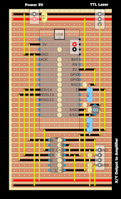
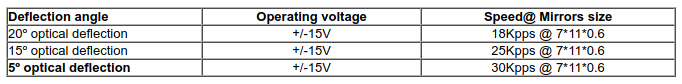
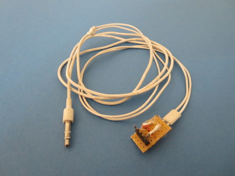
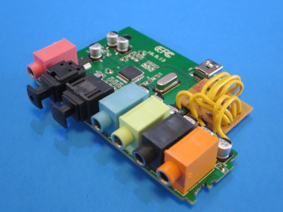
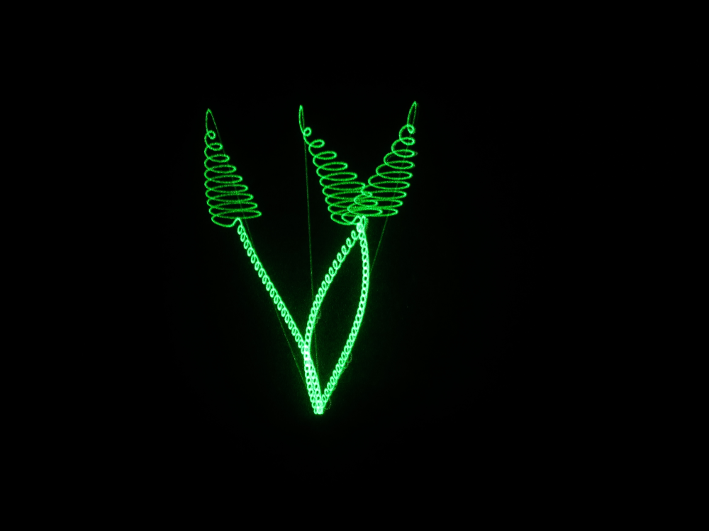

# LaserDemo
Generate display patterns for laser galvanometer, using ESP8266.  Speed of the pattern is limited by the galvanometers, usually 20,000 - 30,000 positions per second.  A pattern with more than a few thousand positions will flicker.  Large patterns, e.g. LouisWainCat @ 20,000 positions, require a long exposure (one second) to view.

Based on "Arduino Laser Show With Real Galvos" by DeltaFlo:

http://www.instructables.com/id/Arduino-Laser-Show-With-Real-Galvos/


## Hardware

* Adafruit HUZZAH ESP8266 (https://www.adafruit.com/product/2821)
* Laser Galvonometer (e.g.: https://www.ebay.com/itm/20Kpps-max-30kpps-laser-scanning-galvo-scanner-ILDA-Closed-Loop-for-laser-show-/302624823271)
* TTL Laser Diode (https://www.adafruit.com/product/1056)
* Fixed Laser Mounting Stand (https://www.adafruit.com/product/1094)
* Dual Channel 12-bit DAC (MCP4822 or MCP4922.  see: http://www.instructables.com/id/Arduino-Laser-Show-With-Real-Galvos/ for details)
* Bipolar Amplifier (see: http://www.instructables.com/id/Arduino-Laser-Show-With-Real-Galvos/ for details)

### Laser Mounting and the CPU stripboard:




 (M4-.70 screws)

## Interface

The first time it boots it will create a Soft Access Point with **SSID**: `LaserDemo` and **PSK**: `carbondioxide`.<br> Open <http://laserdemo.local/config> to configure the WiFi<br>

<http://laserdemo.local/> allows you to select objects for display:


- The Object and Generator lists are generated dynamically from the contents of the objName and genName arrays.
- **KPPS** is the speed of the scanner, Kilo Positions Per Second
- **LTD** Laser Toggle Delay, the latency of the scanner, in microseconds
- **LQ** Laser Quality, maximum line segment length

## Adjust Amplifier Gain and Scan Rate(KPPS) using ILDA Test Pattern

*It is impossible to scan both fast and wide.* 

[ILDA Test Pattern Tuning](https://www.ilda.com/resources/StandardsDocs/ILDA_TestPattern95_rev002.pdf)

When the amplifier gain matches the scan rate, the middle circle will fit inside the the middle square, just touching the sides:


I got good results with 15 degrees deflection @ 20 KPPS (9.5" wide at 36").<br>
Typical generic galvonometer specs:



## Adding Objects

### Convert an ILDA file to an include object (.h)

Convert the ILD file to text using LaserBoy http://laserboy.org/code/LaserBoy_2017_08_06.zip:

- i input
- 1 ILD
- filename
- 1 replace
- o output
- 4 text
- 3 all frames
- filename

LaserBoy has options for optimizing the output (e.g.: h - shiftS) which might also be useful.

Convert the text file to an include file (.h):

```
Scripts/convert.pl ilda12k.txt
```

### Include the .h file inside the *setup()* function:
```
void setup()
{ 
  // initialize object array 
  #include "ilda12k.h"
  #include "barney10.h"
  ...
```


## Audio Input

It's also possible to drive the galvonomters directly with an audio signal, bypassing the ESP8266.  

For that you need a cable and an audio interface modified for DC-coupling:




Several laser programs can generate the audio (even LaserBoy), or use a DSP program like GRC or **Linux Laptop Orchestra** (Pd-L2Ork/Purr-data): 



