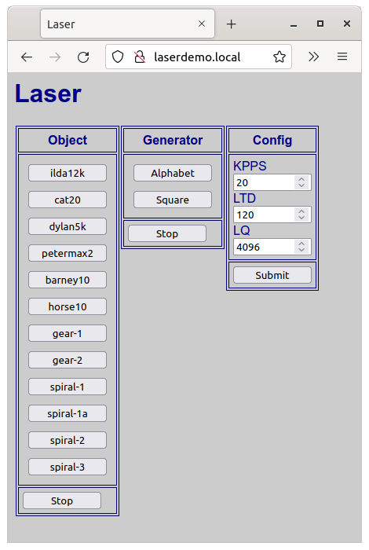

# LaserDemo
Generate test patterns for laser galvanometer

Based on "Arduino Laser Show With Real Galvos" by DeltaFlo:

http://www.instructables.com/id/Arduino-Laser-Show-With-Real-Galvos/


## Target Device

  **Adafruit HUZZAH ESP8266**
  
Memory usage:
```
Sketch uses 483399 bytes (46%) of program storage space. Maximum is 1044464 bytes.
Global variables use 41296 bytes (50%) of dynamic memory, leaving 40624 bytes for local variables. Maximum is 81920 bytes.
```

## User Interface

  The web page allows you to select objects defined in the program:


